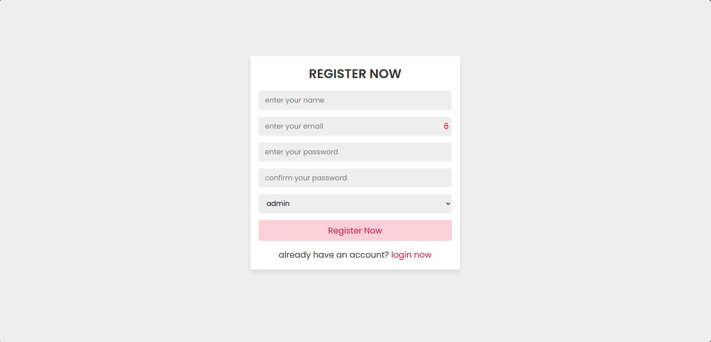
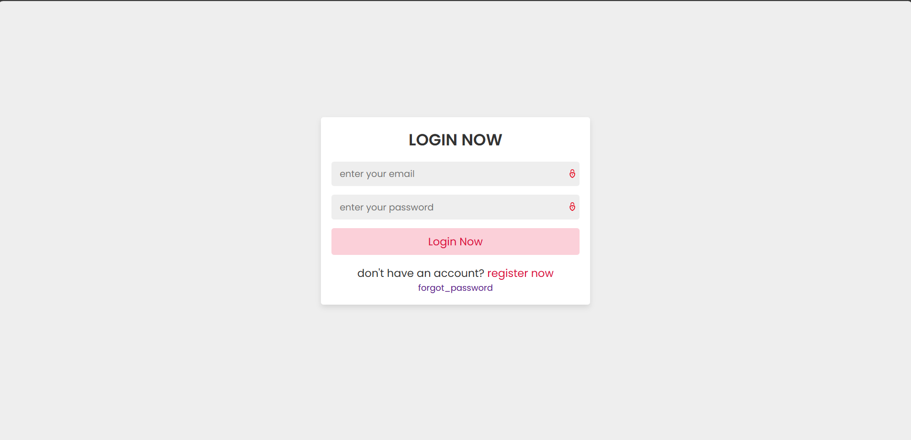
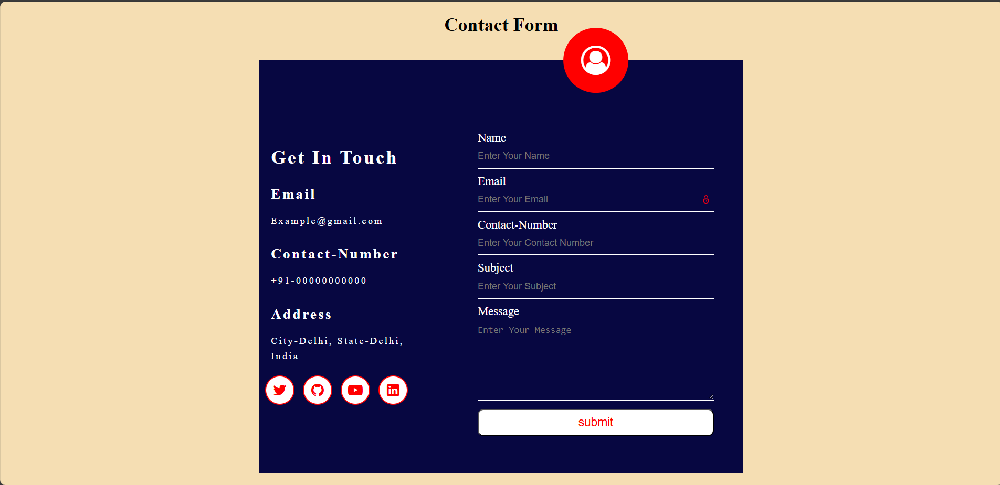
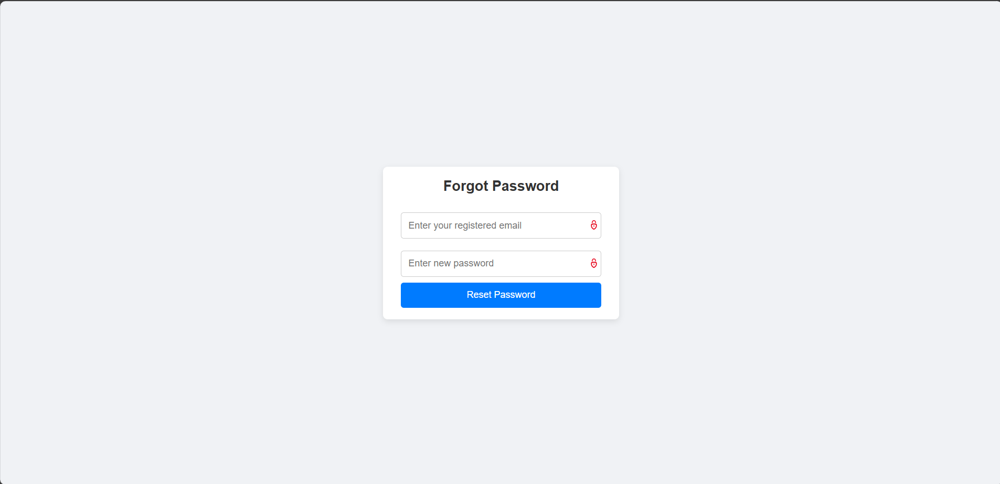
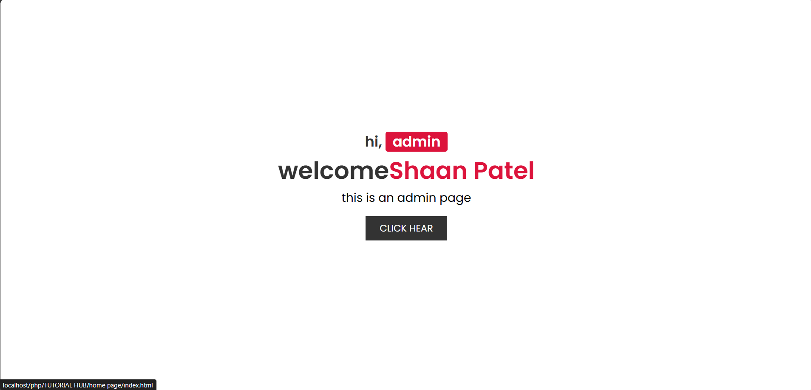

## Tutorial Hub Project 🎓  

**Tutorial Hub** is a web-based platform designed to provide a user-friendly interface for accessing educational content. It features an intuitive homepage, a contact form, and a user management system for registration, login, and password management.  


## ✨ Features  

### 1. **Homepage** 🏠  
- A welcoming interface displaying tutorials, navigation links, and contact details.  
- Highlights the faculty's information and tutorial categories.  

### 2. **User Authentication** 🔒  
- **Registration**: Users can sign up with their email and password.  
- **Login**: Secure login system to access personalized content.  
- **Forgot Password**: A reset feature for users to recover their accounts.  

### 3. **Contact Form** 💬  
- Users can submit inquiries or feedback through the contact form.  
- Email integration for sending messages to the support team.  

---

## 📂 Project Structure  

```  
TUTORIAL HUB/  
├── home page/  
│   ├── index.html         # Main homepage  
│   ├── contect/  
│   │   ├── ContactForm.html  # Contact form page  
│   ├── request/  
│       ├── request.php      # Request processing file  
├── login_form.php           # User login functionality  
├── register_form.php        # User registration functionality  
├── forgot_password.php      # Password recovery script  
├── reset_password.php       # Reset password functionality  
├── assets/  
│   ├── css/                 # Stylesheets  
│   ├── js/                  # JavaScript files  
│   ├── images/              # Images used in the website  
```  

---

## 🛠️ Database Setup  

To create the required database for this project, follow these steps:  

1. Open **phpMyAdmin** 🌐.  
2. Run the following SQL queries:  

```sql  
-- Create the database  
CREATE DATABASE IF NOT EXISTS user_db;  
USE user_db;  

-- Create the user_form table  
CREATE TABLE IF NOT EXISTS user_form (  
    id INT(11) AUTO_INCREMENT PRIMARY KEY,  
    name VARCHAR(50) NOT NULL,  
    email VARCHAR(100) NOT NULL,  
    password VARCHAR(255) NOT NULL,  
    user_type ENUM('Admin', 'User') NOT NULL,  
    created_at TIMESTAMP DEFAULT CURRENT_TIMESTAMP  
);  
```  

---

## 🚀 Installation  

1. **Clone the Repository**:  
   ```bash  
   git clone https://github.com/Shaan013/Online-Learning-Hub/tree/main/Online-Learning-Hub.git  
   ```  

2. **Setup Database**:  
   - Use the SQL queries in the **phpMyAdmin** interface to create the database and tables.  

3. **Configure SMTP** (for email services):  
   - Update placeholders in `ContactForm.html`:  
     ```javascript  
     Username: "your-smtp-username",  
     Password: "your-smtp-password",  
     From: "your-email@example.com",  
     ```  

4. **Deploy the Project**:  
   - Use a local server like **XAMPP** or upload the files to a hosting service.  

---

## 📸 Screenshots  

### 1. **Homepage** 🏠  

  
### 2. **Registration Page** 📝  
  

### 3. **Login Page** 🔒  
  

### 4. **Contact Form** 💬  
  

### 5. **Forgot Password Page** ❓  


### **Welcome page🤝**


---

## ⚠️ Security Notes  

- **Sensitive Information**:  
  - Remove or replace placeholder data in the files (e.g., `your-username`, `yourpassword`).  
  - Use `.env` files or secure storage for sensitive data like SMTP credentials and database passwords.  

- **Password Storage**:  
  - Replace MD5 hashing with a more secure algorithm like bcrypt.  

---

## 💡 Usage  

1. **Access the Homepage**:  
   - Navigate to `http://localhost/Online-Learning-Hub/login_form.php` to start.  
2. **Authentication**:  
   - Use the login or register pages to create and access your account.  
3. **Contact Support**:  
   - Fill out the contact form to send inquiries.  

---

## 🌟 Future Enhancements  

- Implement a robust admin dashboard for managing tutorials and users.  
- Add dynamic content management using a backend framework.  
- Enhance security measures for user data and communications.  

---

## 📜 License  

This project is open-source and available under the MIT License. Feel free to modify and distribute it.  

---

## 🤝 Contributors  

- **Shaan Patel**  
- **shivam satapara**

For inquiries, contact us.  

---  
